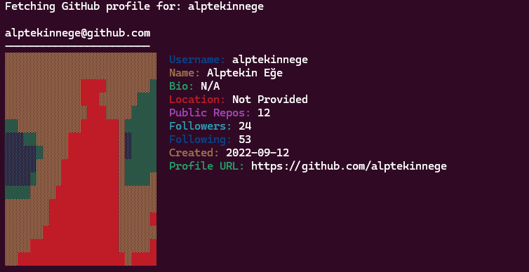

# Github fetch

A neofetch like program for github profiles

## requirements
- requests
- pillow

## Installing
```
pip install requests pillow
gh repo clone https://github.com/alptekinnege/githubfetch-win
```

## Usage
```
python githubfetch.py <username>
```
## Example output

